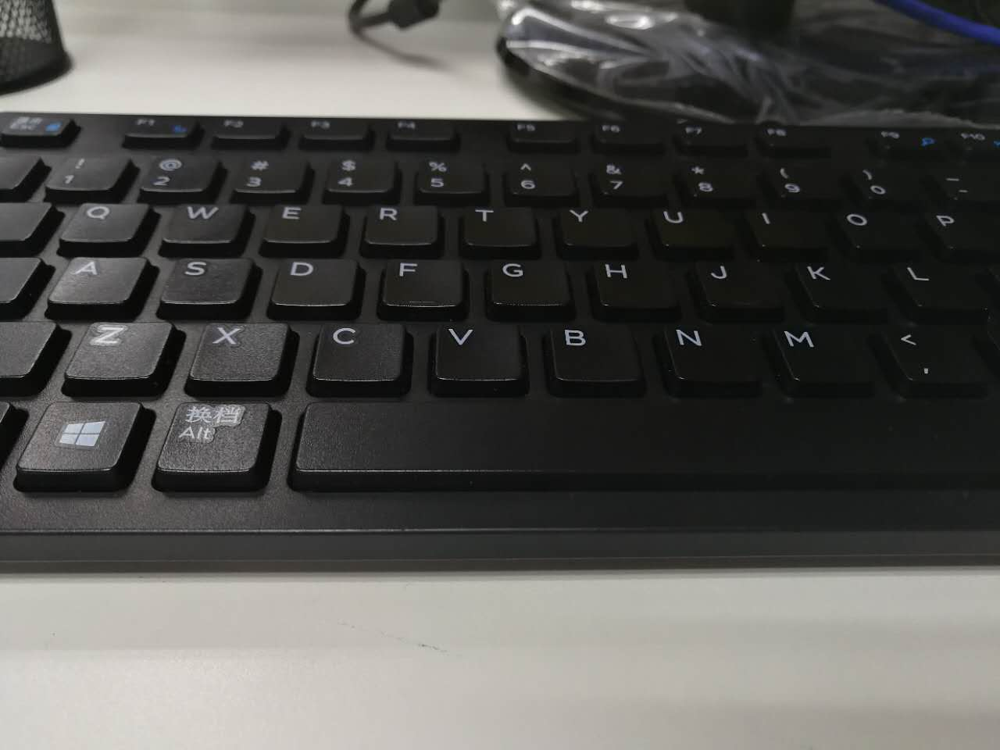
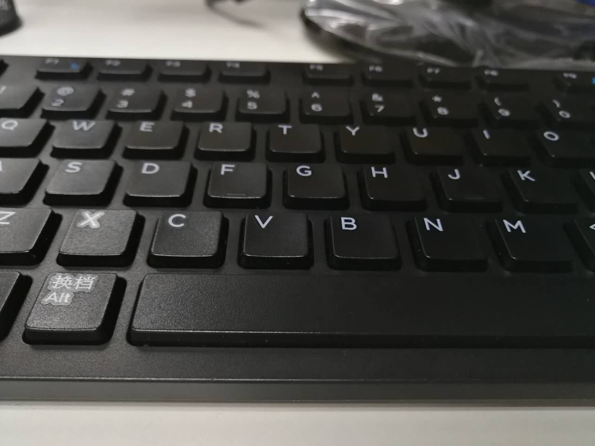

##Inverse Perspective Mapping 反向透视映射求图像中的障碍物
---
单目摄像头作为一种廉价，信息量丰富的传感器，可以大量的使用在机器人领域。但因为其无法判别出图像中的障碍物的位置而提高了机器人避障的难度，使得很多项目不得不放弃单目的方案，转而求其他。尤其是在slam领域，市场上的智能机器人大多都是使用的激光传感器或者双目摄像头来引导机器人避障。但这两者价格昂贵，因为双目摄像头要求较高的标定信息和极低的安装误差，无形中增加了整个项目的开发成本。激光传感器作为slam工程师的宠儿，价格更是高于双目摄像头的。如果使用价格低廉的红外传感器和超声波传感器，又无法为机器人提供可靠的信息，因为宏观上讲，这两种低廉的传感器是一种离散信息，有检测盲区。所以单目摄像头相对于双目摄像头来讲，不需要标定，也不需要太多的考虑双目之间的安装误差。而且也很便宜，如果工程的要求不是很高，50块就可以搞定。

单目摄像头的主要问题是图像的深度信息无获得，导致无法知道前面是什么东西，更别提避障了。在论文 **An Inverse Perspective Mapping Technique Based on a Virtual-Vertical Plane Model for Obstacle Detection Using Mono Camera**和**A Monocular Vision Sensor-Based Obstacle Detection Algorithm for Autonomous Robots**中提到了一种新的通过计算机器人移动过程中前后帧的转换矩阵来求解图像中障碍物的算法。

我们先简单的了解一下IPM算法。反向透视映射，也可以理解为透视变换，顾名思义，就是通过透视原理对原图像中的物体进行变换，生成新的图像。假设你随手拍了一张图片像下面这样

键盘上的英文字符具有自己在图像中的位置，这个位置也能大体的反映出他们在空间上的位置，只是我们不确定键盘属于什么平面。假设我告诉你我相机拍摄的时候，是平行与地面拍摄，相机焦距距离地面5cm，键盘水平放置，你是不是可以大体的猜到这些按键在空间上的位置了吧。
假设我前进5cm又拍了一张图片，如下图

这张很明显和上面那一张有了区别。因为我们在前进的过程中，相机位置变化了，但是物体位置没有变化。那么是否有一种方法建起起这两张图片之间的关系呢？毕竟只是相机在动，物体并没有动。答案是肯定的。仿射变换和透视变换这两种方法可以解决两副图片之间的关系。一般我把仿射变换认为是平面变换，就是你变换的永远是一个平面的东西，比如说你对墙面物体的变换，可以认为是仿射变换，而空间的变换可以使用透视变换。以上解释有待商榷，大家可以自行百度。
使用透视变换处理两幅图片之间的关系
